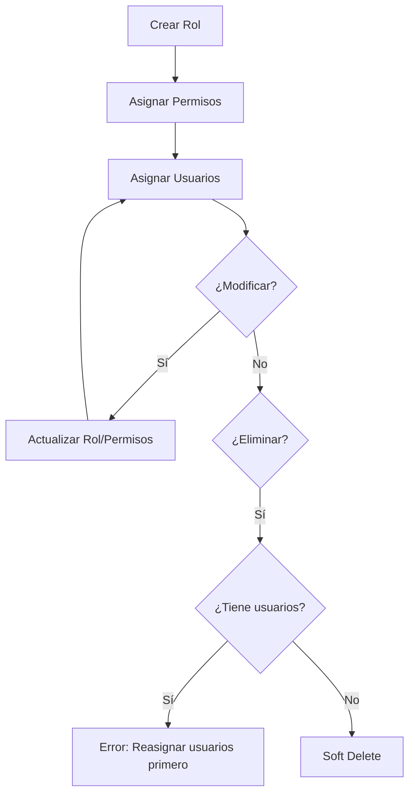

# ?? API CRUD de Roles del Sistema

## ?? Descripción

Controlador completo para la gestión de roles del sistema con operaciones CRUD y gestión de permisos. Permite crear, consultar, actualizar y eliminar roles, así como asignar/eliminar permisos.

---

## ? Características

- ? CRUD completo de roles
- ? Consulta de roles con usuarios y permisos
- ? Asignación masiva de permisos
- ? Agregar/eliminar permisos individuales
- ? Validación de usuarios activos antes de eliminar
- ? Soft delete (desactivación)
- ? Relaciones completas con usuarios y permisos

---

## ?? Endpoints Disponibles

**Ruta Base:** `/api/Roles`

### ?? **CONSULTAS**

#### 1?? Obtener Todos los Roles
```http
GET /api/Roles
GET /api/Roles?includeInactive=true

Authorization: Bearer {token}
```

**Respuesta:**
```json
{
  "message": "Roles obtenidos exitosamente",
  "error": 0,
  "roles": [
    {
      "id": 1,
      "name": "Administrador",
      "description": "Acceso completo al sistema",
      "isActive": true,
      "totalUsers": 1,
      "totalPermissions": 77
    },
    {
      "id": 3,
      "name": "Vendedor",
      "description": "Permisos de ventas y clientes",
      "isActive": true,
      "totalUsers": 2,
      "totalPermissions": 12
    }
  ],
  "totalRoles": 5
}
```

---

#### 2?? Obtener Rol por ID (con usuarios y permisos)
```http
GET /api/Roles/{id}
Authorization: Bearer {token}
```

**Ejemplo:**
```http
GET /api/Roles/3
```

**Respuesta:**
```json
{
  "message": "Rol obtenido exitosamente",
  "error": 0,
  "data": {
    "id": 3,
    "name": "Vendedor",
    "description": "Permisos de ventas y clientes",
    "isActive": true,
    "totalUsers": 2,
    "totalPermissions": 12,
    "users": [
      {
        "id": 2,
        "code": "VEN001",
        "name": "Juan Vendedor",
        "email": "juan@sistema.com",
        "active": true
      }
    ],
    "permissions": [
      {
        "id": 1,
        "name": "Create",
        "resource": "Customer",
        "description": "Crear clientes"
      },
      {
        "id": 15,
        "name": "Create",
        "resource": "Sale",
        "description": "Crear ventas"
      }
    ]
  }
}
```

---

#### 3?? Obtener Usuarios de un Rol
```http
GET /api/Roles/{id}/users
Authorization: Bearer {token}
```

**Ejemplo:**
```http
GET /api/Roles/3/users
```

**Respuesta:**
```json
{
  "message": "Usuarios obtenidos exitosamente",
  "error": 0,
  "data": {
    "roleId": 3,
    "roleName": "Vendedor",
    "users": [
      {
        "id": 2,
        "code": "VEN001",
        "name": "Juan Vendedor",
        "email": "juan@sistema.com",
        "active": true
      }
    ],
    "totalUsers": 2
  }
}
```

---

#### 4?? Obtener Permisos de un Rol
```http
GET /api/Roles/{id}/permissions
Authorization: Bearer {token}
```

**Ejemplo:**
```http
GET /api/Roles/3/permissions
```

**Respuesta:**
```json
{
  "message": "Permisos obtenidos exitosamente",
  "error": 0,
  "data": {
    "roleId": 3,
    "roleName": "Vendedor",
    "permissions": [
      {
        "id": 1,
        "name": "Create",
        "resource": "Customer",
        "description": "Crear clientes"
      }
    ],
    "totalPermissions": 12
  }
}
```

---

### ? **CREAR**

#### 5?? Crear Nuevo Rol
```http
POST /api/Roles
Authorization: Bearer {token}
Content-Type: application/json

{
  "name": "Supervisor",
  "description": "Supervisor de tienda con permisos limitados",
  "isActive": true
}
```

**Respuesta:**
```json
{
  "message": "Rol creado exitosamente",
  "error": 0,
  "data": {
    "id": 6,
    "name": "Supervisor",
    "description": "Supervisor de tienda con permisos limitados",
    "isActive": true,
    "totalUsers": 0,
    "totalPermissions": 0
  }
}
```

---

### ?? **ACTUALIZAR**

#### 6?? Actualizar Rol
```http
PUT /api/Roles/{id}
Authorization: Bearer {token}
Content-Type: application/json

{
  "name": "Supervisor de Ventas",
  "description": "Supervisor con acceso completo a ventas",
  "isActive": true
}
```

**Ejemplo:**
```http
PUT /api/Roles/6
```

**Respuesta:**
```json
{
  "message": "Rol actualizado exitosamente",
  "error": 0,
  "data": {
    "id": 6,
    "name": "Supervisor de Ventas",
    "description": "Supervisor con acceso completo a ventas",
    "isActive": true,
    "totalUsers": 0,
    "totalPermissions": 0
  }
}
```

---

### ??? **ELIMINAR**

#### 7?? Eliminar Rol (Soft Delete)
```http
DELETE /api/Roles/{id}
Authorization: Bearer {token}
```

**Ejemplo:**
```http
DELETE /api/Roles/6
```

**Respuesta Exitosa:**
```json
{
  "message": "Rol eliminado exitosamente",
  "error": 0,
  "roleId": 6
}
```

**Respuesta con Error (usuarios activos):**
```json
{
  "message": "No se puede eliminar el rol 'Vendedor' porque tiene 2 usuario(s) activo(s) asignado(s)",
  "error": 1,
  "activeUsers": 2
}
```

---

### ?? **GESTIÓN DE PERMISOS**

#### 8?? Asignar Permisos a Rol (Reemplaza Existentes)
```http
POST /api/Roles/{id}/permissions
Authorization: Bearer {token}
Content-Type: application/json

[1, 2, 15, 16, 24, 27]
```

**Ejemplo:**
```http
POST /api/Roles/6/permissions
[1, 2, 15, 16, 24, 27]
```

**Descripción:**
- Elimina todos los permisos existentes del rol
- Asigna los nuevos permisos especificados en el array

**Respuesta:**
```json
{
  "message": "Permisos asignados exitosamente",
  "error": 0,
  "data": {
    "roleId": 6,
    "roleName": "Supervisor de Ventas",
    "totalPermissions": 6,
    "permissionIds": [1, 2, 15, 16, 24, 27]
  }
}
```

---

#### 9?? Agregar Permisos Adicionales a Rol
```http
POST /api/Roles/{id}/permissions/add
Authorization: Bearer {token}
Content-Type: application/json

[19, 20, 21, 22]
```

**Ejemplo:**
```http
POST /api/Roles/6/permissions/add
[19, 20, 21, 22]
```

**Descripción:**
- NO elimina permisos existentes
- Solo agrega los nuevos permisos especificados
- Ignora permisos que ya estaban asignados

**Respuesta:**
```json
{
  "message": "Permisos agregados exitosamente",
  "error": 0,
  "data": {
    "roleId": 6,
    "roleName": "Supervisor de Ventas",
    "addedPermissions": 4,
    "totalPermissions": 10
  }
}
```

---

#### ?? Eliminar Permisos Específicos de un Rol
```http
DELETE /api/Roles/{id}/permissions
Authorization: Bearer {token}
Content-Type: application/json

[19, 20]
```

**Ejemplo:**
```http
DELETE /api/Roles/6/permissions
[19, 20]
```

**Descripción:**
- Elimina solo los permisos especificados
- Mantiene los demás permisos intactos

**Respuesta:**
```json
{
  "message": "Permisos eliminados exitosamente",
  "error": 0,
  "data": {
    "roleId": 6,
    "roleName": "Supervisor de Ventas",
    "removedPermissions": 2,
    "remainingPermissions": 8
  }
}
```

---

## ?? Seguridad

### Permisos Requeridos por Endpoint

| Endpoint | Resource | Action |
|----------|----------|--------|
| **Consultas (GET)** | `Configuration` | `ManageUsers` |
| **Crear (POST)** | `Configuration` | `ManageUsers` |
| **Actualizar (PUT)** | `Configuration` | `ManageUsers` |
| **Eliminar (DELETE)** | `Configuration` | `ManageUsers` |
| **Gestión de Permisos** | `Configuration` | `ManagePermissions` |

### Autenticación
Todos los endpoints requieren:
```
Authorization: Bearer {token}
```

---

## ?? Casos de Uso

### **Caso 1: Crear Rol de Supervisor con Permisos**

```sh
# 1. Crear el rol
POST /api/Roles
{
  "name": "Supervisor",
  "description": "Supervisor de tienda",
  "isActive": true
}

# Respuesta: { "data": { "id": 6 } }

# 2. Asignar permisos al rol
POST /api/Roles/6/permissions
[1, 2, 15, 16, 19, 20, 24, 27]
```

---

### **Caso 2: Actualizar Permisos de un Rol Existente**

```sh
# Opción A: Reemplazar todos los permisos
POST /api/Roles/3/permissions
[1, 2, 3, 15, 16, 17, 24, 27]

# Opción B: Solo agregar nuevos permisos
POST /api/Roles/3/permissions/add
[41, 42, 43]

# Opción C: Eliminar permisos específicos
DELETE /api/Roles/3/permissions
[17, 43]
```

---

### **Caso 3: Consultar Roles para Dropdown/Select**

```sh
GET /api/Roles

# Respuesta simplificada para UI:
{
  "roles": [
    { "id": 1, "name": "Administrador" },
    { "id": 2, "name": "Usuario" },
    { "id": 3, "name": "Vendedor" }
  ]
}
```

---

## ??? Integración Frontend

### TypeScript/JavaScript - Ejemplo

```typescript
interface Role {
  id: number;
  name: string;
  description: string;
  isActive: boolean;
  totalUsers: number;
  totalPermissions: number;
}

interface CreateRoleDto {
  name: string;
  description: string;
  isActive: boolean;
}

class RoleService {
  private baseUrl = 'http://localhost:7254/api/Roles';
  private token: string;
  
  constructor(token: string) {
    this.token = token;
  }
  
  // Obtener todos los roles
  async getRoles(includeInactive: boolean = false): Promise<any> {
    const params = includeInactive ? '?includeInactive=true' : '';
    const response = await fetch(`${this.baseUrl}${params}`, {
      headers: {
        'Authorization': `Bearer ${this.token}`
      }
    });
    return await response.json();
  }
  
  // Obtener rol por ID
  async getRoleById(roleId: number): Promise<any> {
    const response = await fetch(`${this.baseUrl}/${roleId}`, {
      headers: {
        'Authorization': `Bearer ${this.token}`
      }
    });
    return await response.json();
  }
  
  // Crear rol
  async createRole(data: CreateRoleDto): Promise<any> {
    const response = await fetch(this.baseUrl, {
      method: 'POST',
      headers: {
        'Authorization': `Bearer ${this.token}`,
        'Content-Type': 'application/json'
      },
      body: JSON.stringify(data)
    });
    return await response.json();
  }
  
  // Actualizar rol
  async updateRole(roleId: number, data: CreateRoleDto): Promise<any> {
    const response = await fetch(`${this.baseUrl}/${roleId}`, {
      method: 'PUT',
      headers: {
        'Authorization': `Bearer ${this.token}`,
        'Content-Type': 'application/json'
      },
      body: JSON.stringify(data)
    });
    return await response.json();
  }
  
  // Eliminar rol
  async deleteRole(roleId: number): Promise<any> {
    const response = await fetch(`${this.baseUrl}/${roleId}`, {
      method: 'DELETE',
      headers: {
        'Authorization': `Bearer ${this.token}`
      }
    });
    return await response.json();
  }
  
  // Asignar permisos (reemplaza existentes)
  async assignPermissions(roleId: number, permissionIds: number[]): Promise<any> {
    const response = await fetch(`${this.baseUrl}/${roleId}/permissions`, {
      method: 'POST',
      headers: {
        'Authorization': `Bearer ${this.token}`,
        'Content-Type': 'application/json'
      },
      body: JSON.stringify(permissionIds)
    });
    return await response.json();
  }
  
  // Agregar permisos (sin eliminar existentes)
  async addPermissions(roleId: number, permissionIds: number[]): Promise<any> {
    const response = await fetch(`${this.baseUrl}/${roleId}/permissions/add`, {
      method: 'POST',
      headers: {
        'Authorization': `Bearer ${this.token}`,
        'Content-Type': 'application/json'
      },
      body: JSON.stringify(permissionIds)
    });
    return await response.json();
  }
  
  // Eliminar permisos específicos
  async removePermissions(roleId: number, permissionIds: number[]): Promise<any> {
    const response = await fetch(`${this.baseUrl}/${roleId}/permissions`, {
      method: 'DELETE',
      headers: {
        'Authorization': `Bearer ${this.token}`,
        'Content-Type': 'application/json'
      },
      body: JSON.stringify(permissionIds)
    });
    return await response.json();
  }
  
  // Obtener usuarios de un rol
  async getRoleUsers(roleId: number): Promise<any> {
    const response = await fetch(`${this.baseUrl}/${roleId}/users`, {
      headers: {
        'Authorization': `Bearer ${this.token}`
      }
    });
    return await response.json();
  }
  
  // Obtener permisos de un rol
  async getRolePermissions(roleId: number): Promise<any> {
    const response = await fetch(`${this.baseUrl}/${roleId}/permissions`, {
      headers: {
        'Authorization': `Bearer ${this.token}`
      }
    });
    return await response.json();
  }
}
```

---

## ?? Datos de Ejemplo

### **Roles del Sistema:**

| ID | Nombre | Descripción | Usuarios | Permisos | Estado |
|----|--------|-------------|----------|----------|--------|
| 1 | Administrador | Acceso completo al sistema | 1 | 77 | Activo |
| 2 | Usuario | Acceso básico de lectura | 1 | 5 | Activo |
| 3 | Vendedor | Permisos de ventas y clientes | 2 | 12 | Activo |
| 4 | Almacenista | Permisos de productos e inventario | 1 | 10 | Activo |
| 5 | Gerente | Permisos de reportes y análisis | 1 | 25 | Activo |

---

## ? Validaciones Implementadas

1. **Crear Rol:**
   - ? Nombre único (no puede duplicarse)
   - ? Nombre requerido
   
2. **Actualizar Rol:**
   - ? Rol debe existir
   - ? Nombre único (excepto el mismo rol)
   
3. **Eliminar Rol:**
   - ? Rol debe existir
   - ? No puede eliminarse si tiene usuarios activos
   - ? Soft delete (marca como inactivo)
   
4. **Asignar Permisos:**
   - ? Rol debe existir
   - ? Todos los IDs de permisos deben ser válidos
   - ? Retorna error con IDs inválidos

---

## ?? Notas Importantes

- **Soft Delete**: Los roles no se eliminan físicamente, solo se marcan como inactivos (`IsActive = false`)
- **Validación de Usuarios**: No se puede eliminar un rol si tiene usuarios activos asignados
- **Permisos Únicos**: Un rol no puede tener el mismo permiso duplicado
- **Gestión Granular**: Se puede reemplazar todos los permisos, agregar nuevos, o eliminar específicos
- **Relaciones Cascada**: Al desactivar un rol, los usuarios mantienen la relación pero quedan sin acceso

---

## ?? Flujo Recomendado para Gestión de Roles



---

**? API CRUD de Roles - 100% Funcional**  
**?? Ruta API:** `/api/Roles`  
**?? Controller:** `RolesController`  
**??? Tabla:** `Roles`  
**?? Relaciones:** `Users`, `RolePermissions`, `Permissions`
